### 🔧 `api`

1. Ouvre un terminal dans le dossier `api`
2. Installe les dépendances :
    ```bash
    npm install
    ````
3. Lance l'API :
    ```bash
    npm start
    ```
4. Vérifiez que l'API est accessible via `http://0.0.0.0:3000` (ou l'IP locale)

#### Statut du workflow de test :


#### Statut du workflow de release :


# 🌡️ Projet Gestion de Sondes - API Node.js + Flutter

## 🧾 A. Présentation du projet

### 📌 Contexte
Ce projet a pour objectif de permettre la **gestion de sondes environnementales** (température, humidité, etc.) via :
- Une **API Node.js** permettant la communication avec la base de données et les équipements.
- Une **application mobile Flutter** permettant la visualisation des données et la configuration des sondes.

### 🛠️ Technologies utilisées
- Backend : Node.js
- Mobile : Flutter
- Base de données : SQLite
- CI/CD : GitHub Actions
- Infrastructure : Terraform, Ansible
- Versionnement & Releases : GitHub Releases
- Gestion de secrets : GitHub Secrets
- Déploiement : via fichiers YAML (CI, deploy, release)
- Outils : CCG, Git

## 🌱 B. Mise en place du GitFlow

### 🔀 Branches utilisées
- `main` : version en production.
- `develop` : branche d'intégration continue.
- `feature/*` : développement de fonctionnalités.
- `release/*` : stabilisation avant mise en production.
- `hotfix/*` : corrections urgentes en production.

### 🧾 Historique des branches et commits
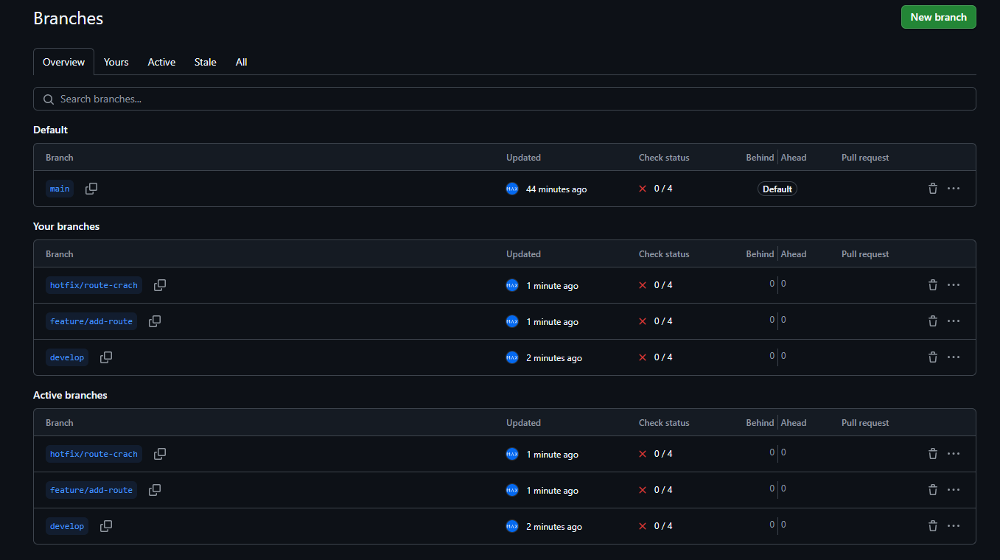
_Légende : Vue des branches `main`, `develop`, `feature/*`_

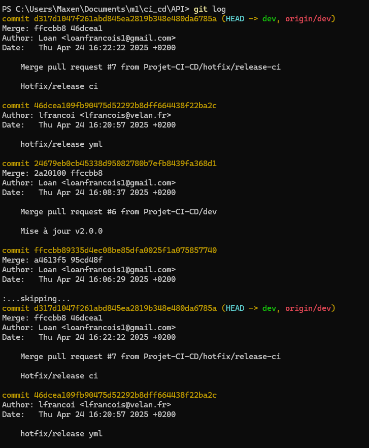
_Légende : Historique des commits avec messages clairs et versions taggées_

## ⚙️ C. Pipeline CI/CD

### 📂 Fichiers YAML CI/CD
- [`ci.yml`](.github/workflows/ci.yml) : Lint, test et build
- [`deploy.yml`](.github/workflows/deploy.yml) : Déploiement staging & production
- [`release.yml`](.github/workflows/release.yml) : Création de release et tag

### 🚀 Étapes du pipeline
1. **Lint** : vérification du code source (Node + Flutter)
2. **Test** : exécution des tests unitaires
3. **Build** : génération des builds (Flutter + Node)
4. **Packaging** : archive versionnée
5. **Déploiement Staging** : push automatique sur serveur de test via Ansible
6. **Déploiement Production** : déclenché manuellement via GitHub Actions
7. **Snapshot** : sauvegarde de la base de données
8. **Rollback** : restauration d’une version antérieure si besoin

### 📸 Exécution du pipeline
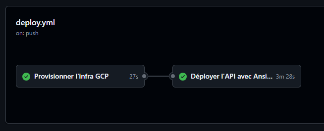
_Légende : Étapes visibles du pipeline GitHub Actions_
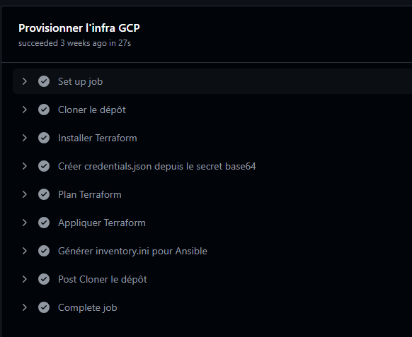
_Légende : Étapes infra GCP_
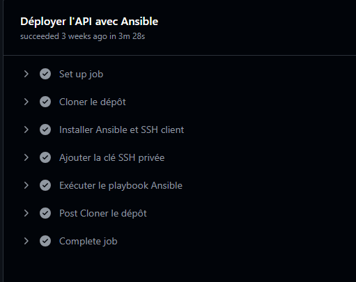
_Légende : Étapes Déployer l'api avec ansible_

## 📦 D. Packaging & Versionning

### 🔢 Versionnement SemVer
Nous utilisons le versionnement sémantique (standard-version) :
- `MAJOR.MINOR.PATCH` (ex : `1.2.0`)

### 🏷️ Git Tag & Releases
- Les versions sont taguées via GitHub Actions :  
  `git tag -a vX.Y.Z -m "Release X.Y.Z"`
  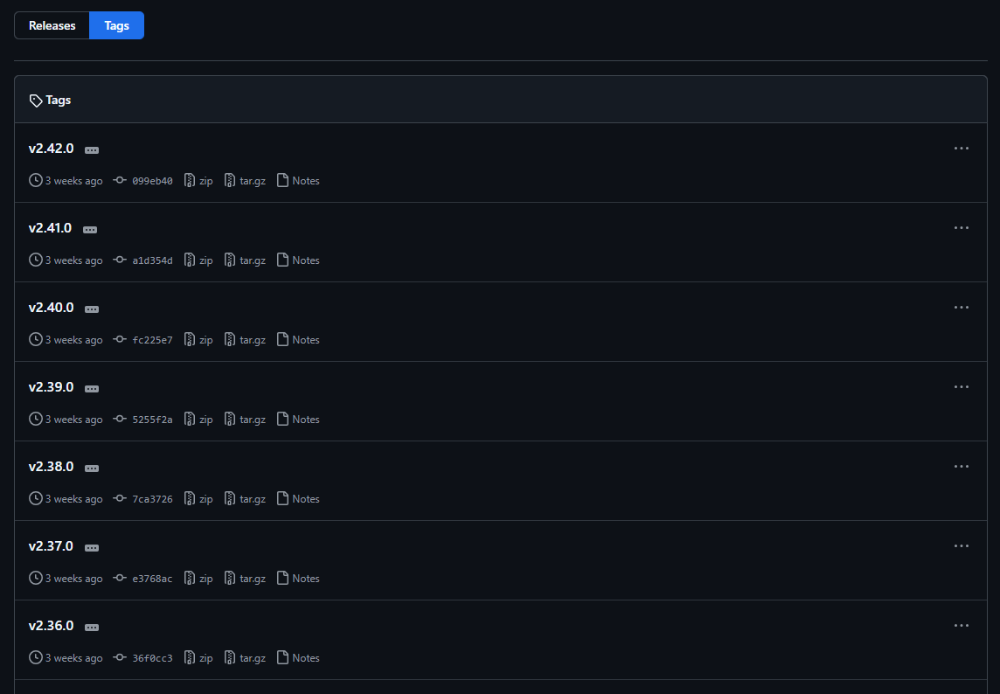
- Stockage des artefacts sur GitHub Releases  
  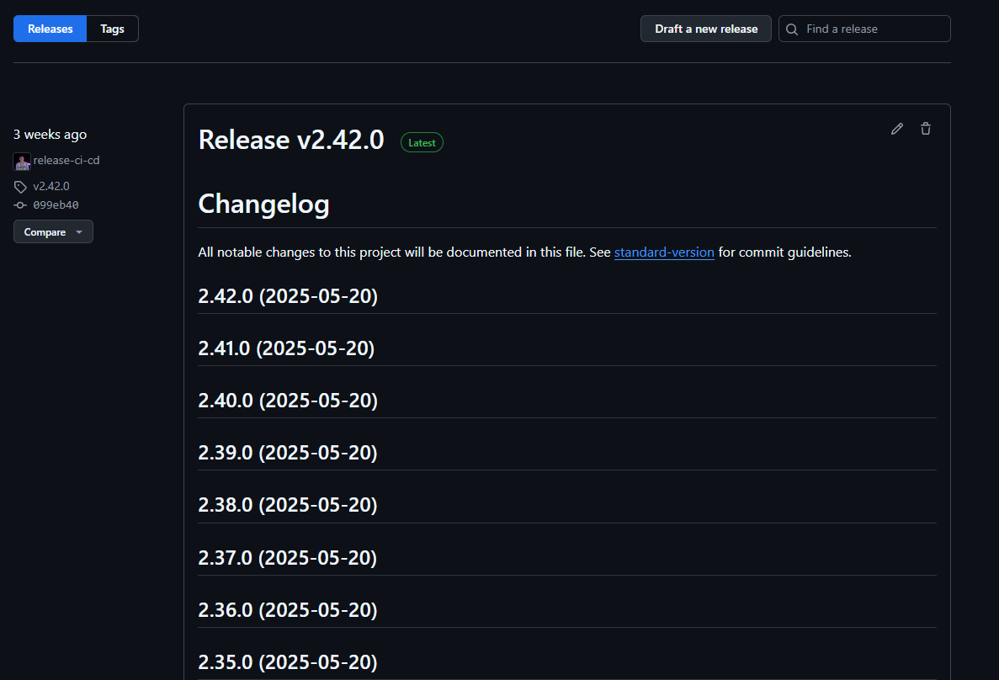
  

## 🔐 E. Gestion des secrets & environnements

### 🔒 Méthode
- Secrets stockés dans **GitHub Secrets**
- Accès via `${{ secrets.MY_SECRET }}` dans les fichiers YAML 
  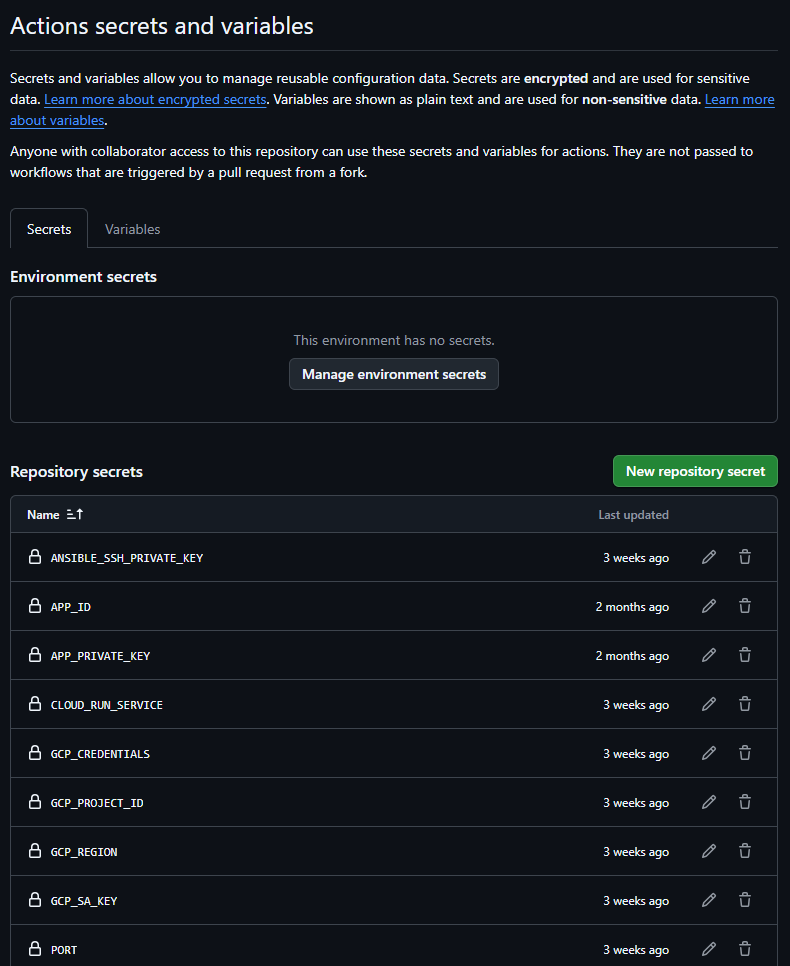

### ✅ Bonnes pratiques
- Aucun secret dans le code source
- `.env` ignoré via `.gitignore`
- Accès restreint aux workflows sensibles

## 🧪 F. Tests & Logs

### 📘 Exemple de log commenté
on utilise prometheus et Grafana
```bash
✔ Lint OK
✔ Tests OK (Coverage : 95%)
✔ Build Flutter OK
✔ Déploiement staging : OK
✖ Déploiement production : erreur Ansible (permission denied)
```
_Légende : Logs clairs, erreurs commentées, interventions rapides possibles_
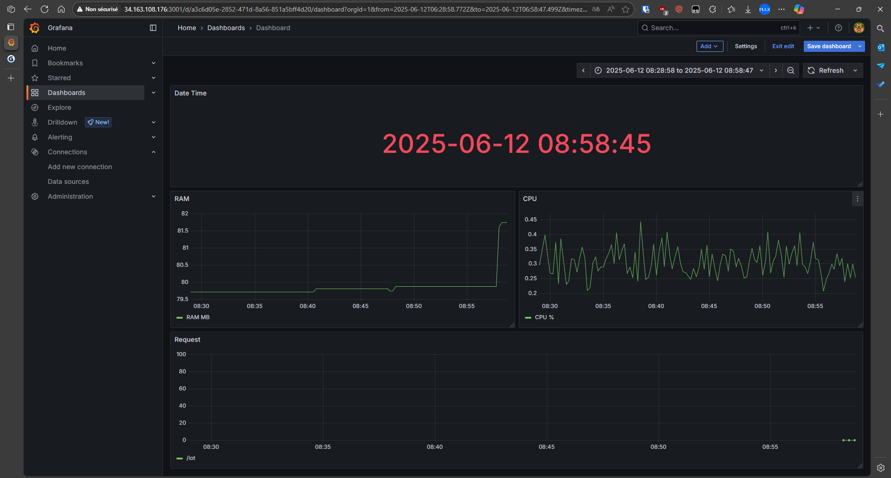

## 🖼️ G. Captures d’écran obligatoires

| Capture | Légende |
|--------|---------|
|  | Exécution complète du pipeline CI/CD |
|  | Vue des branches Git |
|  | Historique des commits sur `main` et `develop` |
|  | Tag Git utilisé pour release |
|  | Logs/Monitoring de production |
| 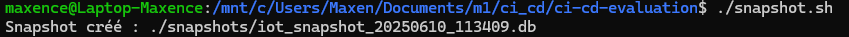 | Snapshot déclenché après déploiement |
| 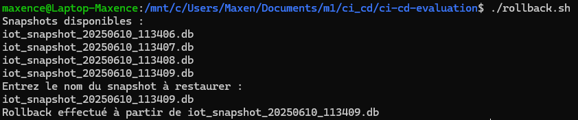 | Capture après rollback (restauration réussie) |

## 📚 H. Procédures documentées

### 🚀 Procédure de déploiement
```bash
# Sur develop après test
git checkout release/vX.Y.Z
git merge develop
git tag -a vX.Y.Z -m "Release X.Y.Z"
git push origin --tags
# GitHub déclenche automatiquement le pipeline de release
```

### 🧭 Plan de versionnage
- Une version par sprint
- Tag à chaque release validée
- Historique conservé sur GitHub Releases

---

© Projet Sondes — 2025 — Tous droits réservés.
